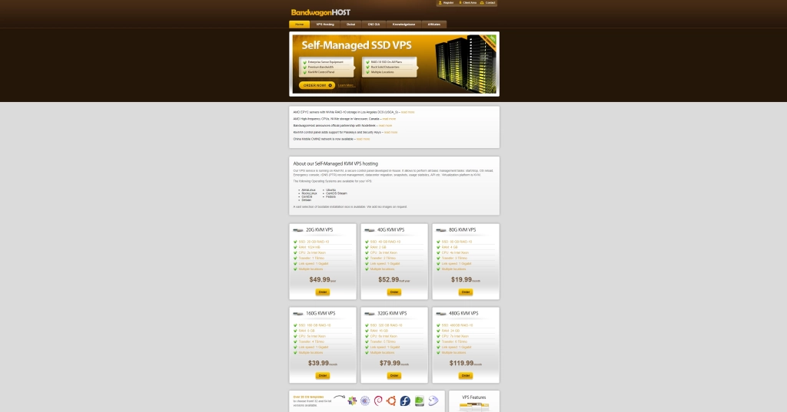

# 搬瓦工 BiggerBox Pro 限量版上线：年付仅需39美元的高性价比选择

---

如果你正在寻找一款价格实惠、线路优质且性能稳定的VPS方案，那么搬瓦工这次推出的BiggerBox Pro限量版可能正是你需要的。这个套餐年付只要39美元，配备1核AMD CPU、1GB内存、20GB SSD硬盘和1000GB月流量，关键是它采用了电信CN2 GIA和移动/联通CMIN2的三网优质线路。对于需要搭建个人博客、小型网站或者测试项目的用户来说，这个配置完全够用，而且价格门槛极低。

---

## 搬瓦工的全球机房布局

搬瓦工（BandwagonHost）隶属于加拿大IT7科技公司，是一家在VPS领域深耕多年的提供商。他们的产品基于KVM虚拟化技术，在全球部署了十几个机房，包括香港CN2 GIA、洛杉矶DC6 CN2 GIA-E、DC9 CN2 GIA、日本软银JPOS_1、荷兰EUNL_9联通机房以及美国Fremont等热门数据中心。

这种广泛的机房布局意味着什么？简单来说，无论你的目标用户在哪里，你都能找到一个离他们更近、速度更快的节点。比如你的网站主要面向国内用户，香港CN2 GIA机房就是不错的选择；如果你需要兼顾全球访问，美国或欧洲的机房也能提供稳定的连接。

## 各类方案的性价比对比

搬瓦工提供的方案种类不少，每种都有自己的特点。我们来看看几个比较有代表性的：

**美国CN2 GIA-E方案**是很多用户公认的"性价比之王"。它提供1TB流量的版本年付119.99美元，2TB流量的版本年付229.99美元。这个系列的优势在于CN2 GIA-E线路对国内访问非常友好，延迟低、速度快，而且流量给得很大方。如果你的网站流量需求比较大，或者需要跑一些数据密集型的应用，这个方案值得考虑。

**中国香港CN2 GIA方案**则是追求"极致速度"用户的首选。500GB月流量的版本月付89.99美元，1TB流量的版本月付155.99美元。香港机房的物理距离近，加上CN2 GIA线路加持，访问速度确实快到飞起。不过价格也相对较高，更适合对延迟和速度有极高要求的场景，比如游戏服务器或者实时通信应用。

**美国CN2方案**提供半年付和年付选项，价格相对便宜一些，但线路质量比GIA-E稍逊一筹。如果你的预算有限，而且对速度要求不是特别苛刻，这个方案也够用。

**KVM多机房方案**的特点是流量给得很大，但从性价比角度来说，它并不是最优选择。这类方案更适合那些需要频繁切换机房、测试不同线路的用户。

而这次推出的👉 [BiggerBox Pro限量版套餐，年付仅39美元](https://bandwagonhost.com/aff.php?aff=79616)，可以说是把性价比拉到了一个新高度。1核AMD CPU、1GB内存、20GB SSD硬盘和1000GB月流量，虽然配置看起来不算豪华，但对于大多数轻量级应用来说完全够用。更重要的是，它采用了洛杉矶DC1机房，电信走CN2 GIA线路，移动和联通走CMIN2线路——这意味着三大运营商的用户都能获得不错的访问体验。

## 为什么BiggerBox Pro值得关注

说实话，39美元一年的VPS市场上并不少见，但能做到这个价格还保证线路质量的，真的不多。搬瓦工这次的BiggerBox Pro之所以吸引人，核心就在于它的线路配置。

CN2 GIA是电信的精品网络，延迟低、丢包少，对国内用户来说体验非常好。CMIN2则是中国移动国际有限公司的优化线路，移动和联通用户也能享受到相对流畅的访问速度。三网都有照顾到，这在低价VPS里真的很少见。

从实际使用场景来说，如果你是个人博主，想搭建一个WordPress网站或者Hugo静态博客，这个配置完全够用。1GB内存跑个网站加上基础的数据库服务没什么压力，20GB的SSD硬盘存储网站文件、图片和一些小工具也绰绰有余。1000GB的月流量对于中小型网站来说也足够了，除非你的网站突然爆红，否则基本不会用完。

如果你是开发者，需要一个测试环境来跑一些代码、调试API或者搭建CI/CD流程，BiggerBox Pro也是个不错的选择。价格便宜，出问题了也不心疼，而且搬瓦工的服务器重装系统很方便，折腾起来没什么负担。

当然，这个套餐也有它的局限性。1核CPU和1GB内存意味着它不适合跑大型应用或者高并发服务。如果你的网站日访问量达到几万甚至几十万，或者需要跑一些吃资源的程序（比如机器学习模型、大型数据库），那还是老老实实选择更高配置的方案吧。

## 限量供应，要抢得快

搬瓦工这次把BiggerBox Pro定位为"限量版"，意思很明显——数量有限，卖完就没了。从目前的反馈来看，不少玩家已经迅速下单，部分地区的机房甚至出现了暂时售罄的情况。

这种限量策略一方面是为了控制服务器负载，保证服务质量；另一方面也可能是一种营销手段，制造紧迫感让用户尽快决策。不管怎么说，如果你对这个套餐感兴趣，还是尽早下手比较保险。毕竟39美元一年的价格，试错成本也不高，大不了用一年看看效果。

👉 [如果你正在犹豫要不要入手，不妨先了解一下搬瓦工的其他套餐](https://bandwagonhost.com/aff.php?aff=79616)，对比一下不同方案的配置和价格，看看哪个最适合你的需求。

## 搬瓦工的附加功能和灵活性

除了基础的VPS服务，搬瓦工还提供了一些比较实用的附加功能。比如你可以根据需要添加额外的IPv4或IPv6地址，这对于需要多IP部署的用户来说很方便。虽然BiggerBox Pro是限量版套餐，但这些附加选项依然可用。

搬瓦工的控制面板也设计得比较简洁，重装系统、更换机房、查看流量使用情况等操作都能在几分钟内完成。对于新手来说，这种友好的操作界面能省去不少学习成本；对于老手来说，效率高、不折腾也是加分项。

另外，搬瓦工的客服响应速度还算不错。虽然不是24小时即时回复那种，但提交工单后通常能在一两天内得到回复。考虑到这个价位和服务质量，这个响应速度已经算可以接受了。

---

搬瓦工这次推出的BiggerBox Pro限量版套餐，年付39美元，配备三网优质线路和1000GB月流量，对于需要低成本、高性价比VPS的用户来说确实是个不错的选择。无论你是想搭建个人博客、测试项目，还是需要一个稳定的小型服务器环境，这个配置都能满足基本需求。限量供应意味着机会有限，如果你正好在找这样一款VPS，不妨考虑尽快入手。👉 [点击这里了解更多搬瓦工套餐详情](https://bandwagonhost.com/aff.php?aff=79616)，找到最适合你的那一款。
